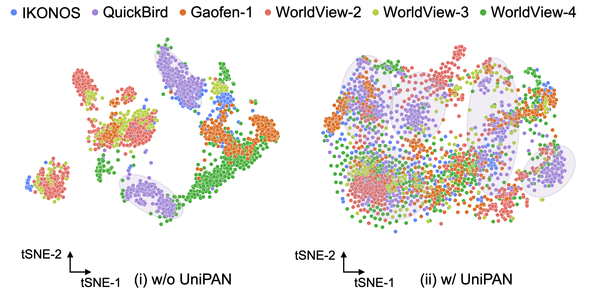
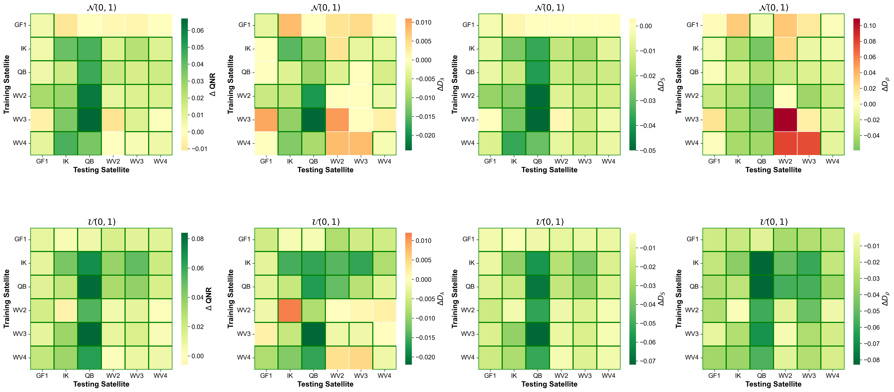

# [ICCV 2025] Enpowering Your Pansharpening Models with Generalizability: Unified Distribution is All You Need

This repository contains the complete code for our paper [*Enpowering Your Pansharpening Models with Generalizability: Unified Distribution is All You Need*](https://openaccess.thecvf.com/content/ICCV2025/html/Cui_Enpowering_Your_Pansharpening_Models_with_Generalizability_Unified_Distribution_is_All_ICCV_2025_paper.html), including implementations for UniPAN training and testing on all 12 models (GPPNN, PanNet, PNN, FusionNet, FeINFN, UAPN, SFIIN, PreMix, MSDCNN, MSDDN, LAGConv, MDCUN).

<hr />

> **Abstract:** *Existing deep learning-based models for remote sensing pansharpening exhibit exceptional performance on training datasets. However, due to sensor-specific characteristics and varying imaging conditions, these models suffer from substantial performance degradation when applied to unseen satellite data, lacking generalizability and thus limiting their applicability. We argue that the performance drops stem primarily from distributional discrepancies from different sources and the key to addressing this challenge lies in bridging the gap between training and testing distributions. To validate the idea and further achieve a "train once, deploy forever" capability, this paper introduces a novel and intuitive approach to enpower any pansharpening models with generalizability by employing a unified distribution strategy (UniPAN). Specifically, we construct a distribution transformation function that normalizes the pixels sampled from different sources to conform to an identical distribution. The deep models are trained on the transformed domain, and during testing on new datasets, the new data are also transformed to match the training distribution. UniPAN aims to train and test the model on a unified and consistent distribution, thereby enhancing its generalizability. Extensive experiments validate the efficacy of UniPAN, demonstrating its potential to significantly enhance the performance of deep pansharpening models across diverse satellite sensors. Codes: https://github.com/yc-cui/UniPAN.* 
<hr />

## Algorithm and Results






## Environment Setup  
We provide an `env.yaml` file containing the complete conda environment configuration. To create the environment:  

1. Create conda environment from YAML file:  
```bash
conda env create -f env.yaml
```  

2. Activate the environment:  
```bash
conda activate unipan  # Use your environment name if different
```  


## Dataset Preparation
We use the public **NBU_PansharpRSData** dataset. Follow these steps to prepare the data:
1. Download and unzip the dataset
2. Modify dataset paths in the corresponding network file under `examples/` directory. For example, in `examples/{MODEL_NAME}.py`, update the `sensor2dir` dictionary:
```python
sensor2dir = {
    'wv2': '{YOUR_DATA_DIR}/5 WorldView-2',
    'gf1': '{YOUR_DATA_DIR}/3 Gaofen-1',
    'ik': '{YOUR_DATA_DIR}/1 IKONOS',
    'wv3': '{YOUR_DATA_DIR}/6 WorldView-3',
    'wv4': '{YOUR_DATA_DIR}/4 WorldView-4',
    'qb': '{YOUR_DATA_DIR}/2 QuickBird',
}
```
Replace the paths with your actual dataset locations.

## Training & Testing
### Basic Usage
1. Refer to parameter settings in the network files under `examples/`
2. Example command for training FeINFN with UniPAN on IKONOS and testing on multiple sensors:
```bash
python examples/FeINFN.py \
    --out_dist uniform \
    --train_sensor ik \
    --test_sensors wv2,gf1,wv3,wv4,qb
```

### Key Parameters
- `--out_dist`: Target distribution type (`uniform`/[others])
- `--train_sensor`: Training sensor name (e.g., `ik`)
- `--test_sensors`: Comma-separated list of test sensors

## Outputs
- Training logs and model weights are saved in `logs_uni/` directory
- Results are organized by experiment configuration

## Citation
If you find this work useful, please cite our paper:

```bibtex
@InProceedings{Cui_2025_ICCV,
    author    = {Cui, Yongchuan and Liu, Peng and Zhang, Hui},
    title     = {Enpowering Your Pansharpening Models with Generalizability: Unified Distribution is All You Need},
    booktitle = {Proceedings of the IEEE/CVF International Conference on Computer Vision (ICCV)},
    month     = {October},
    year      = {2025},
    pages     = {11850-11860}
}
```
